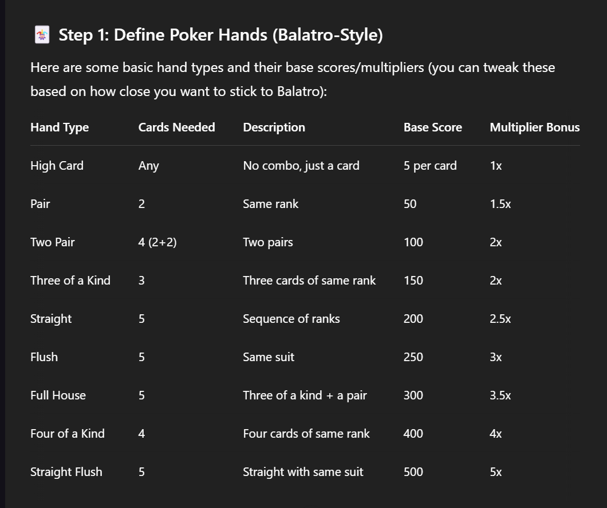

# Main Idea

A card game combining mechanics inspired by Honkai: Star Rail (HSR) with elements similar to Balatro.

## Monster Structure

Monsters have the following attributes:

- Stamina Bar

- Health Bar

- Damage

- Monster Element (Displays weaknesses)

- Action Turns

## Play Deck Card Structure

Inspired by the traditional 52-card deck.

## Hero Structure
Each hero has the following attributes:

- HP (Health Points)

- ATK (Attack)

- SHD (Shield)

- LIST<EFFECTED> (List of active effects)

- Role

- ...

## Heroe Types

There are 3 main hero types:

- DPS (Damage Dealer)

- Buffer (Support that boosts allies)

- Debuffer (Applies negative effects on enemies)

Players can select 3 heroes per game session.
(In this version only play 1 Hero each time)

## Hero Classification

Heroes are classified in two main ways:

- By Element: Fire, Earth, Water, and Wind

- By Effect Type: DOT (Damage Over Time): e.g. Poison, Bleeding, Hard CC (Crowd Control): e.g. Freeze, Shock
, Stacked Damage Effects: Require accumulation to trigger damage, Break Effects: Used to break enemy weaknesses, Healing Effects, Taunt and Other Utility Effects,...

 

## Player Attributes
Players have the following properties:

- Amount of in-game currency owned

## License

This project is licensed under the MIT License

Background trippy
#003C2F
Background
#319679
